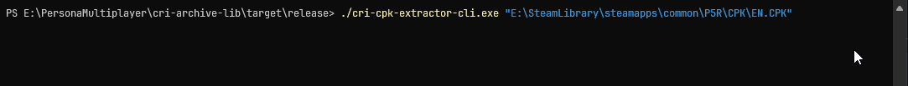

# cri-archive-lib

A Rust crate for reading CRI table formats. The CPK portion of this crate is effectively a port of 
[CriFsV2Lib](https://github.com/Sewer56/CriFsV2Lib) from C#.

## CPK Extractor Tool

`cri-cpk-extractor-lib` is a tool for extracting all files from an input CPK. Downloads are available in Releases.

This program can either be run by dragging a CPK file onto the executable or through the command line using the following:

```
./cri-cpk-extractor-cli.exe [Input] (Output)
```



Where for each of the following parameters:
- **Input**: A path to the imput CPK which will get extracted
- **Output (optional)**: The folder that the CPK's files will get written into. By default, this will create a folder
adjacent to the CPK with it's name.

## Crate Features

- **CRI Table Parsing Structures**
- **CPK Parsing**
- **CriLAYLA Decompression**
- **Table Decryption**
- **User-definable File Decryption**

## Crate Usage

### Table Parsing Structures

- **`TableHeader`**: A thin wrapper around a byte slice starting at where the table begins in the stream.
- **`Column`**: Represents a column in the CRI Table. Contains data type information, a pointer to the column's name that can be retrived using a `StringPool` and a default value if applicable
- **`StringPoolImpl` and `StringPoolFast`**: Holds references to strings from the stream. Used to retrieve strings from string pointers (`u32` relative to `string_pool_offset`). Implementors of `StringPool`.
- **`Row`**: A row of values (`RowValue`) for each column. 

**Example**:

```rust
use std::fs::File;
use std::io::{BufReader, Read};
use std::mem::MaybeUninit;
use crate::schema::columns::Column;
use crate::schema::header::{TableHeader, HEADER_SIZE};
use crate::schema::strings::{ StringPool, StringPoolImpl };
use crate::schema::rows::{Row, RowValue};

// ...

// Read sample ACB (using Metaphor: ReFantazio's BGM ACB)
let mut handle = BufReader::new(File::open("E:/Metaphor/base_cpk/COMMON/sound/bgm.acb")?);
let mut header_serial: MaybeUninit<[u8; HEADER_SIZE]> = MaybeUninit::uninit();
// Read the table header at 0x0 (ACB, ACF, AWB)
handle.read_exact(unsafe { header_serial.assume_init_mut() })?;
let header_serial = unsafe { header_serial.assume_init() };
let header = TableHeader::new(&header_serial);
// Read columns/rows
let columns = Column::new_list(&mut handle, &header)?;
let string_pool = StringPoolImpl::new(&mut handle, &header)?;
let rows = Row::new_list(&mut handle, &header, &columns)?;
let acb_row = &rows[0]; // ACB header has only one row
// find the column for "AcfMd5Hash"
let mut acf_md5_hash: Option<usize> = None;
for (i, c) in columns.iter().enumerate() {
  if let Some(str) = string_pool.get_string(c.get_string_offset()) {
    if str == "AcfMd5Hash" {
      acf_md5_hash = Some(i);
      break;
    }
  }
}
if let Some(acf_col) = acf_md5_hash {
  if let RowValue::Data(hash) = &acb_row[acf_col] {
    // read the ACF MD5 hash
    handle.seek(SeekFrom::Start((header.data_pool_offset() + hash.offset) as u64))?;
    let mut acf_md5 = Vec::with_capacity(hash.length as usize);
    unsafe { acf_md5.set_len(acf_md5.capacity()) };
    handle.read_exact(&mut acf_md5)?;
    println!("{:?}", acf_md5);
  }
}
Ok(())
```

Output:
```
[236, 103, 97, 106, 90, 25, 172, 164, 161, 234, 209, 75, 242, 34, 227, 209]
```

### `CpkReader` Usage

```rust
use std::collections::HashMap;
use std::error::Error;
use std::fs::File;
use std::io::BufReader;
use crate::cpk::encrypt::p5r::P5RDecryptor;
use crate::cpk::reader::CpkReader;

// ...

// P5R: Extract C0001_002_00.GMD from BASE.CPK
// Adapted from one of the unit tests

// Define a CpkReader with a custom decryptor
let mut reader = CpkReader::<_, P5RDecryptor>::new_with_encryption(
    BufReader::new(File::open("E:/SteamLibrary/steamapps/common/P5R/CPK/BASE.CPK")?))?;
// Get a file list
let files = reader.get_files()?;
let mut file_lookup = HashMap::new();
for file in &files {
    file_lookup.insert(format!("{}/{}", file.directory(), file.file_name()), file);
}
let joker_persona_5 = file_lookup.get("MODEL/CHARACTER/0001/C0001_002_00.GMD").unwrap();
// Extract the file, performing decryption and decompression and write it out
let joker_persona_5 = reader.extract_file(joker_persona_5)?;
std::fs::write("joker_persona_5.GMD", joker_persona_5)?;
Ok(())
```

## Performance

Performance was heavily optimized for parts of the crate that are used by `CpkReader`'s `extract_file`:

#### CriLAYLA Decompression

**[Sample 165 KB model file](https://github.com/Sewer56/CriFsV2Lib/blob/master/CriFsV2Lib.Tests/Assets/Compressed3dModel.crilayla)**

| Library | Mean | Error | Std Dev |
| - | - | - | - |
| CriPak (C#) |
| CriFsLib (C#) |
| cri-archive-lib (Rust) |

#### Table Decryption

**2 MB encrypted header (P5R `BASE.CPK`)**

| Library                | Mean | Error | Std Dev |
|------------------------| - | - | - |
| CriPak (C#)            |
| CriFsLib (C#)          |
| CriFsLib InPlace |
| cri-archive-lib (Rust) |

## Credits and Resources
- **Sewer56** ([Github](https://github.com/Sewer56), [Bluesky](https://bsky.app/profile/sewer56.dev)) - Creator of CriFsV2Lib, the original C# implementation of the CPK extractor
  - [`CriFsV2Lib`](https://github.com/Sewer56/CriFsV2Lib)

The following credits are included from CriFsV2Lib:
- **Lipsum** ([Github](https://github.com/zarroboogs)) - Original creator of P5R decryption function
- **TGE** ([Github](https://github.com/tge-was-taken/), [Twitter](https://x.com/TGEnigma)) - [CRI Table 010 Template](https://github.com/tge-was-taken/010-Editor-Templates/blob/master/releases/cri_archives/cri_archives_rel_1.bt)
- **Skyth** ([Github](https://github.com/blueskythlikesclouds), [Bluesky](https://bsky.app/profile/skyth.bsky.social)) - [MikuMikuLibrary `UtfTable`](https://github.com/blueskythlikesclouds/MikuMikuLibrary/blob/master/MikuMikuLibrary/Archives/CriMw/UtfTable.cs)
- **CriPakTools Developers** - [CriPakTools](https://github.com/wmltogether/CriPakTools)